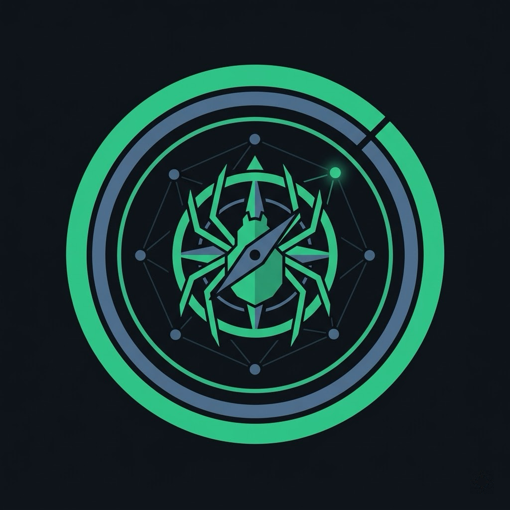

<p align="center">
  
</p>

# SafiCrawl

**An in-editor website crawler and SEO auditing tool for Visual Studio Code.**

SafiCrawl brings a full-featured crawler, SEO analyzer, and Core Web Vitals reporter directly into VS Code — no Python, no Docker, no hosted service. Everything runs inside the extension: crawl a staging site before you deploy, audit a client site without leaving your editor, validate docs against broken links while you write them.

## Setup after installing

SafiCrawl works out of the box for plain HTTP crawling — no setup needed. Two optional features need a one-time setup: **JavaScript rendering** and **PageSpeed Insights**. Do either or both depending on what you'll use.

### 1. Install Playwright (for JavaScript rendering)

Only needed if you want to crawl React / Vue / Angular / any SPA with fully-rendered HTML. SafiCrawl does **not** bundle Playwright — it uses your install so one `.vsix` works across every VS Code version.

In any terminal:

```bash
# Install the Node package globally (or in a workspace — either works)
npm i -g playwright

# Download the Chromium browser binary (~170 MB, one-time)
npx playwright install chromium
```

> **Important:** the `npx playwright install chromium` command is required and must be run manually. The in-extension "Install Playwright Browsers" command currently doesn't install the headless-shell variant Playwright needs at runtime. Running it in a terminal does.

Then in VS Code:

1. `Cmd/Ctrl+Shift+P` → **SafiCrawl: Check Playwright Install** — should report "Playwright detected at …".
2. Open **Settings** → **SafiCrawl** → **Javascript** → turn on **Enable Rendering**.

That's it. Next crawl will use the browser.

### 2. Set the PageSpeed Insights API key (for Core Web Vitals)

Only needed if you want Google Lighthouse metrics (LCP / CLS / FCP / INP / TTFB) per URL. Free, takes about a minute.

1. Get a free API key: <https://developers.google.com/speed/docs/insights/v5/get-started>.
2. In VS Code: `Cmd/Ctrl+Shift+P` → **SafiCrawl: Set PageSpeed API Key…** → paste the key.

   _(Stored in the OS keychain via VS Code `SecretStorage` — never in `settings.json`, never sent to the webview.)_

3. Open **Settings** → **SafiCrawl** → **Pagespeed** → turn on **Enabled**.

Or do it from the panel: **SafiCrawl: Open Dashboard** → **PageSpeed** tab → sidebar **API Key** section → **Set Key…**.

PageSpeed runs automatically when a crawl finishes.

### 3. You're ready

`Cmd/Ctrl+Shift+P` → **SafiCrawl: Start Crawl** → enter a URL → the dashboard streams results live.

---

## What it does

- **Crawls any website** from a seed URL — follows internal links, respects `robots.txt`, discovers sitemaps (including gzipped sitemap-index recursion), filters by extension/regex/depth.
- **Analyzes SEO across 11 categories** — title tags, meta descriptions, headings, content length, canonicals, Open Graph, Twitter Cards, JSON-LD / microdata, hreflang, analytics detection, charset, Core Web Vitals.
- **Detects issues** with configurable thresholds across title / meta / headings / content / technical / mobile / accessibility / social / structured-data / performance / indexability categories.
- **Renders JavaScript** (optional) via your own Playwright install — crawls React / Vue / Angular / any SPA with fully-hydrated HTML.
- **Runs PageSpeed Insights** post-crawl when you provide a Google API key — shows LCP, CLS, FCP, INP, TTFB, and Lighthouse performance score per URL with medians.
- **Visualizes the site graph** as an interactive force-directed network with nodes colored by status code.
- **Persists crawls** — every crawl is saved, survives window close, and can be loaded, resumed, archived, or deleted from the activity bar.
- **Exports results** to CSV, JSON, or XML for external reporting.

## Quick start

1. Install from the VS Code Marketplace (or side-load the `.vsix`).
2. Open the Command Palette (`Cmd/Ctrl+Shift+P`) → **SafiCrawl: Start Crawl**.
3. Enter a URL (e.g. `https://example.com`). The dashboard opens and starts streaming results.
4. Switch between the nine tabs to explore:
   - **Overview** — every URL crawled with status, title, word count, load time, issue count.
   - **Internal / External** — scoped views of the same table.
   - **Status Codes** — grouped by 2xx/3xx/4xx/5xx with drill-down.
   - **Links** — source → target edge table with placement (navigation / body / footer) and broken-link count.
   - **Issues** — SEO issues grouped by category with severity dots; click any issue to jump to that URL.
   - **PageSpeed** — Core Web Vitals medians and per-URL metrics.
   - **Visualization** — force-directed graph of the site structure.
   - **Settings** — live-sync form for every crawler option.

## Commands

All commands are available from the Command Palette.

| Command                                           | What it does                                                      |
| ------------------------------------------------- | ----------------------------------------------------------------- |
| `SafiCrawl: Start Crawl`                          | Prompt for a URL and start a new crawl.                           |
| `SafiCrawl: Stop Crawl`                           | Stop the running crawl (state is saved for resume).               |
| `SafiCrawl: Pause / Resume`                       | Pause or resume mid-crawl.                                        |
| `SafiCrawl: Open Dashboard`                       | Open the 9-tab webview panel.                                     |
| `SafiCrawl: Export Results…`                      | Export URLs / links / issues as CSV / JSON / XML.                 |
| `SafiCrawl: Load Saved Crawl…`                    | Load a past crawl from the sidebar into the panel.                |
| `SafiCrawl: Open Settings`                        | Jump to the SafiCrawl section in VS Code settings.                |
| `SafiCrawl: Install Playwright Browsers`          | Run `npx playwright install` in a terminal task.                  |
| `SafiCrawl: Check Playwright Install`             | Report which Playwright (workspace or global) SafiCrawl detected. |
| `SafiCrawl: Open Playwright Install Instructions` | Open the Playwright docs.                                         |
| `SafiCrawl: Set PageSpeed API Key…`               | Store a Google PSI key in the OS keychain.                        |
| `SafiCrawl: Clear PageSpeed API Key`              | Remove the stored key.                                            |
| `SafiCrawl: Refresh Saved Crawls`                 | Re-read the sidebar from disk.                                    |

## Saved crawls (activity bar)

The SafiCrawl icon on the VS Code activity bar opens a **Saved Crawls** tree listing every past crawl with its status, URL count, and timestamp. Right-click any entry for:

- **Load** — hydrate the dashboard without re-crawling.
- **Resume** — continue a stopped or interrupted crawl from the exact checkpoint.
- **Archive** / **Unarchive** — hide old crawls without deleting them.
- **Delete** — remove the crawl and all its rows (confirm modal).

When VS Code closes mid-crawl, the next activation flips the row to `interrupted` and offers Resume.

## Settings

All settings live under the `SafiCrawl.*` namespace in `settings.json` and are also editable via the in-panel **Settings** tab (two-way synced).

### Crawler

- `crawler.maxDepth` — max link depth from seed (1–10, default 3).
- `crawler.maxUrls` — cap on URLs per crawl (default 5 000).
- `crawler.delay` — seconds between requests (0–60, default 1.0).
- `crawler.concurrency` — parallel workers (1–50, default 5).
- `crawler.followRedirects` — follow 3xx (default true).
- `crawler.includeExternal` — include external-domain URLs (default false).
- `crawler.discoverSitemaps` — auto-fetch sitemap.xml + `Sitemap:` from robots.txt (default true).

### Requests

- `requests.userAgent` — outbound UA string.
- `requests.timeout` — seconds per request (1–120, default 10).
- `requests.retries` — exponential-backoff retry count (0–10, default 3).
- `requests.respectRobots` — honor `robots.txt` disallow rules (default true).
- `requests.acceptLanguage` — `Accept-Language` header.

### JavaScript rendering (optional)

- `javascript.enabled` — render HTML pages via Playwright (default false).
- `javascript.browser` — `chromium` / `firefox` / `webkit`.
- `javascript.viewportWidth` / `.viewportHeight` — render viewport.
- `javascript.concurrency` — concurrent headless pages (1–10, default 3).
- `javascript.waitTime` — seconds to wait after `DOMContentLoaded` for hydration.
- `javascript.timeout` — per-page render timeout (5–120s, default 30).
- `javascript.playwrightPath` — optional explicit path to a Playwright install (leave empty for auto-detect).

### Filters

- `filters.includeExtensions` — if set, only crawl URLs ending in these extensions.
- `filters.excludeExtensions` — skip URLs with these extensions (default: `.pdf .zip .mp4 .jpg .png .gif .svg .css .js`).
- `filters.urlRegex` — only crawl URLs matching this regex.
- `filters.maxFileSizeMB` — hard cap on response body size (default 10 MB).

### PageSpeed

- `pagespeed.enabled` — run PSI after each crawl (default false).
- `pagespeed.urlLimit` — max URLs to analyze per run (default 50).
- `pagespeed.strategy` — `mobile` / `desktop` / `both`.

### Advanced

- `advanced.proxy` — outbound proxy URL.
- `advanced.customHeaders` — extra request headers object.
- `advanced.logLevel` — `error` / `warn` / `info` / `debug`.
- `diagnostics.enabled` — surface issues for workspace-mapped URLs in the Problems panel.
- `telemetry.enabled` — opt-in telemetry (default false).

## JavaScript rendering

JS rendering is **off by default** and requires **Playwright** — not bundled with SafiCrawl to keep the extension small.

If you want it:

```bash
# In any project folder or globally
npm i -g playwright
```

Then run **SafiCrawl: Install Playwright Browsers** once (downloads Chromium ~170 MB). SafiCrawl auto-detects Playwright from:

1. An explicit path in `SafiCrawl.javascript.playwrightPath`.
2. The current workspace's `node_modules/playwright`.
3. `npm root -g` (global install).

Toggle `javascript.enabled` on and crawl an SPA — URLs come back with fully-hydrated content instead of empty shells. `javascriptRendered: true` is stamped on those rows.

## PageSpeed Insights

1. Get a free API key from <https://developers.google.com/speed/docs/insights/v5/get-started>.
2. Run **SafiCrawl: Set PageSpeed API Key…** and paste it (stored in the OS keychain via VS Code `SecretStorage` — never in `settings.json`).
3. Enable `pagespeed.enabled` in settings.
4. Start a crawl. When it finishes, SafiCrawl queries Google for up to `pagespeed.urlLimit` URLs at 1 req/s with 429 backoff.
5. The **PageSpeed** tab fills with CWV medians and per-URL metrics.

## Exports

**SafiCrawl: Export Results…** writes the dataset (URLs / links / issues) in your choice of CSV, JSON, or XML to a workspace-accessible path via the standard VS Code save dialog.

## Data storage

All crawl history lives in a single SQLite file inside VS Code's extension global storage (platform-specific path):

- macOS: `~/Library/Application Support/Code/User/globalStorage/<publisher>.saficrawl/crawls.sqlite`
- Windows: `%APPDATA%\Code\User\globalStorage\<publisher>.saficrawl\crawls.sqlite`
- Linux: `~/.config/Code/User/globalStorage/<publisher>.saficrawl/crawls.sqlite`

SafiCrawl uses **`sql.js`** — SQLite compiled to WebAssembly. There are no native modules: one `.vsix` works on every VS Code / Electron version, no `electron-rebuild` ever required. The file is a standard SQLite database; you can open it with any SQLite CLI or GUI for ad-hoc analysis.

The **PageSpeed API key** lives separately in the OS keychain (macOS Keychain / Windows Credential Vault / libsecret) via `SecretStorage`, never in the DB.

## Web VS Code / Codespaces

SafiCrawl works in web VS Code with one limitation: JavaScript rendering requires Playwright, which needs a local Node process, so `javascript.enabled` is force-disabled in web contexts with a one-time notification. HTTP-only crawling, issue detection, persistence, and PageSpeed all work.

## Development

```bash
git clone <repo>
cd SafiCrawl
npm install
npm run compile
```

Press **F5** in VS Code to launch an Extension Development Host with SafiCrawl loaded. Edit TypeScript and esbuild auto-rebuilds (`npm run watch`).

### Scripts

- `npm run compile` — one-shot build.
- `npm run watch` — watch mode (esbuild + tsc).
- `npm run check-types` — type-check only.
- `npm run lint` — ESLint.
- `npm run test:engine` — Mocha tests for the crawler engine and storage layer.

### Tests

The engine and storage layers are pure TypeScript with no VS Code deps. `npm run test:engine` runs:

- Unit tests for the SEO extractor, issue detector, link manager, rate limiter, and sitemap parser.
- An end-to-end crawl test against a local `http.createServer` fixture.
- A round-trip persistence test that creates, saves, loads, archives, and deletes a synthetic crawl.

## Architecture overview

SafiCrawl is a pure VS Code extension — no external server, no language bridge, no Docker.

- The **crawler engine** is TypeScript + `undici` for HTTP, `cheerio` for parsing, `robots-parser`, `fast-xml-parser` for sitemaps. BFS with a Promise-based worker pool, token-bucket rate limiting, configurable thresholds.
- The **webview** is React 19 + Tailwind v4 + TanStack Virtual for tables + vis-network for the graph. State lives in a zustand store driven by typed `postMessage` events.
- The **controller** bridges engine events and webview state, batches up to 50 rows or 100 ms for efficient IPC, and writes every batch through to `sql.js` for persistence.
- The **Playwright renderer** is optional and plugged into the crawler only when available.
- The **PSI client** runs post-crawl with backoff and streaming results.

## Support and feedback

SafiCrawl is actively developed. File issues at the repository or reach out via the marketplace listing.

## License

MIT © Abdulkader Safi
